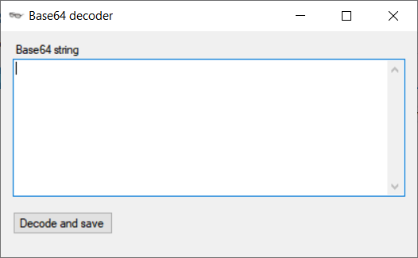

# cs-base64-decoder
Windows application to decode base64 string to binary file

To run just download and run [base64decoder.exe](bin/Debug/) file

Program created with Microsoft Visual Studio 2019, download repository and open `base64decoder.sln` file